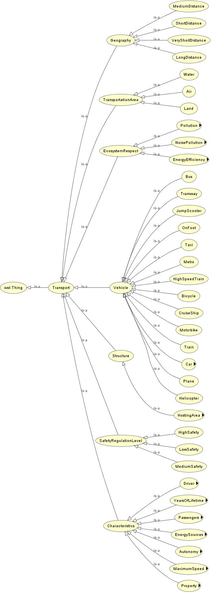
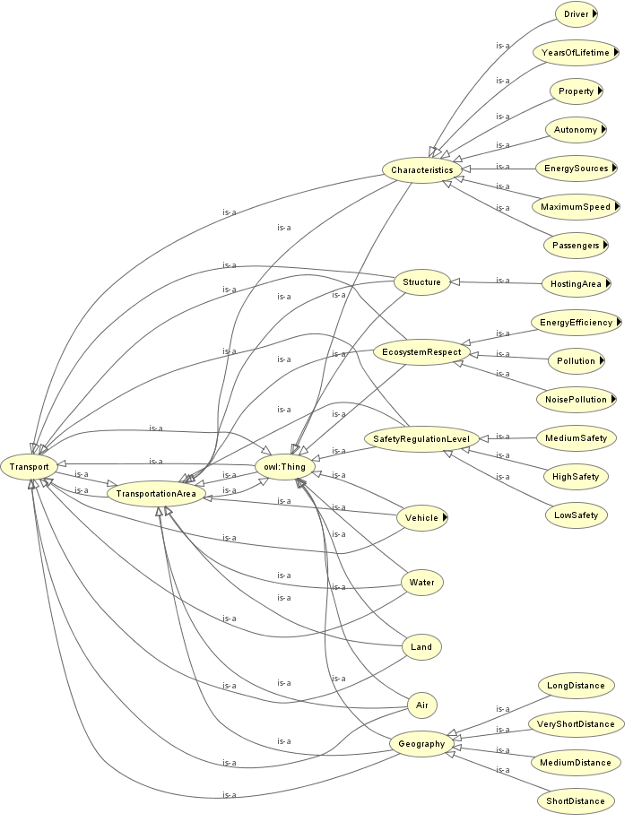
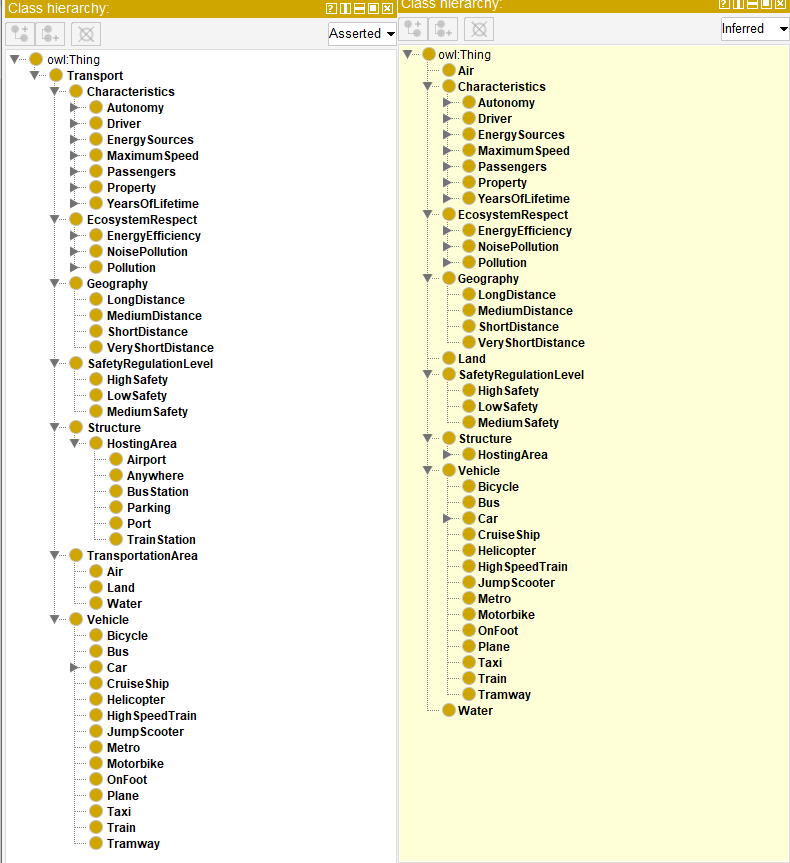
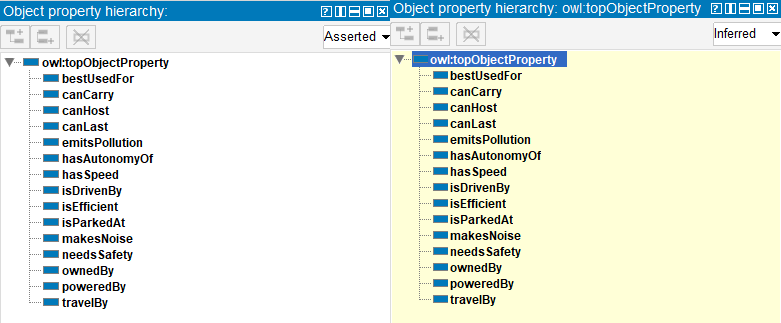
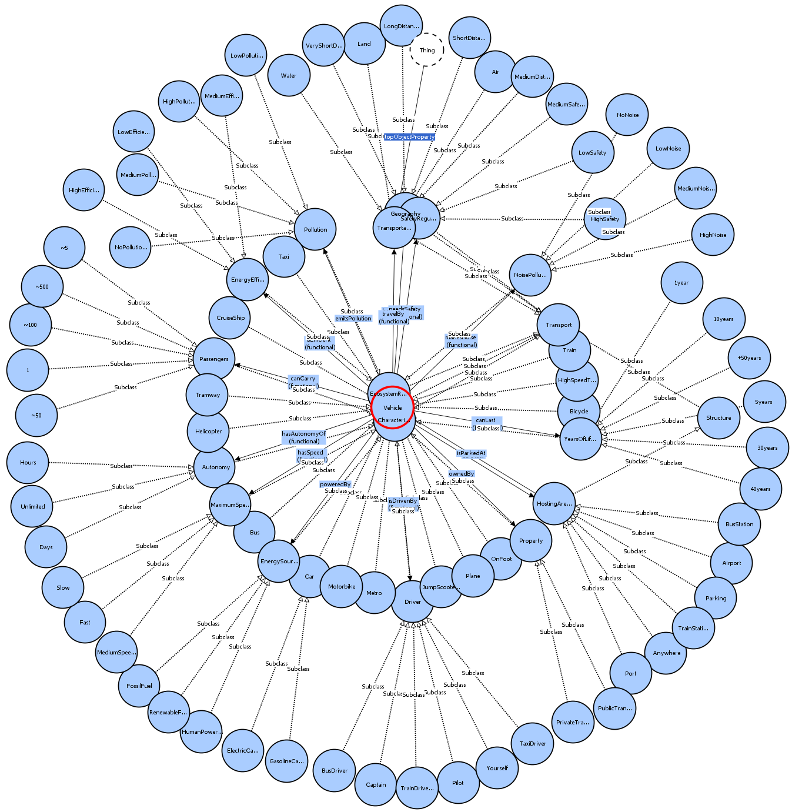

## transport-ontology

### course project IA301 at Telecom Paris on Ontologies by { Pierre Mathieu, Pascal Nguyen, Ivan Lopes }

This is an ontology about means of transportations and their characteristics, to help decide which mean of  transportation to take to minimize the impact on the environnement (pollution, noise pollution, etc...).

**Asserted graph**:

**Inferred graph**:

**Class hierarchies**:

**Object properties hierarchies**:

**Network graph**:

